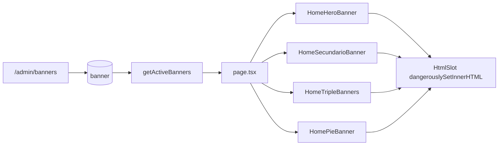

# Banners dinámicos de la home (admin + render)

Documentación de la feature de **banners administrables de la home** para futuros cambios.

**Admin:** `/admin/banners`  
**Última actualización:** 2026-07-25

---

## 1. Qué hace

1. Cuatro ubicaciones de la home se arman desde la tabla `banner` (no hardcode de copy/imagen en `page.tsx`).
2. Cada banner tiene **imagen de fondo** + **HTML editable** (texto, botones, logos) en un textarea del admin.
3. Solo se muestran banners `activo` y dentro de vigencia (`vigencia_desde` / `vigencia_hasta`).
4. Todo se administra en `/admin/banners` (listado tabla + `/nuevo` + `/[id]`), mismo patrón que promociones.

---

## 2. Ubicaciones (`ubicacion`)

Constantes en [`src/lib/banners.ts`](../src/lib/banners.ts) (`BANNER_UBICACIONES`).

| Valor | Sección home | Tamaño preferido de imagen | Notas |
|-------|--------------|----------------------------|--------|
| `hero` | Arriba de todo (`.oc-hero-live`) | ~1200×560 px | Imagen a la derecha (~62%); degradado oscuro a la izquierda. HTML tipicamente envuelto en `.oc-hero-live-copy` |
| `secundario` | Franja bajo la barra utilitaria (`.oc-mundial`) | ~1480×160 px | Alto visible mín. ~112 px. HTML: `.oc-mundial-copy` + `.oc-mundial-aside` |
| `triple` | Grid de 3 tarjetas (`.oc-promo-grid`) | ~940×430 px (display ~470×214) | **Tres registros** con `orden` 1, 2 y 3. Usar `clase_css`: `oc-promo-dark` u `oc-promo-light` |
| `pie` | Último bloque (`.oc-zagg-banner`) | ~1480×220 px | Fondo vía CSS var `--oc-banner-bg`. HTML: logo + copy + badge |

Otras secciones de la home (barra utilitaria, Destacados, JBL, trío Audio/Mochilas/Fundas, Potenciá) **siguen hardcodeadas** en `page.tsx` / assets estáticos.

---

## 3. Modelo de datos

Definido en [`prisma/schema.prisma`](../prisma/schema.prisma) — modelo `banner`.

| Campo | Tipo | Uso |
|-------|------|-----|
| `id_banner` | PK | |
| `titulo` | string | Solo admin / listado |
| `imagen_desktop` | string | Fondo (path `/oneclick/…` o upload `banners/…`) |
| `imagen_mobile` | string? | Opcional (hero puede usar `srcSet`) |
| `link` | string? | Legado; el CTA real va en el HTML |
| `ubicacion` | string | `hero` \| `secundario` \| `triple` \| `pie` |
| `orden` | int | Menor = primero; en triple: 1, 2, 3 |
| `vigencia_desde` / `vigencia_hasta` | DateTime | Filtro de vigencia (`hasta` null = sin fin) |
| `activo` | bool | |
| `html` | Text? | Markup inyectado en la home (`dangerouslySetInnerHTML`) |
| `clase_css` | string? | Extra en el contenedor (ej. `oc-promo-dark`) |

### Dónde guardar el HTML

En la **misma fila** (`banner.html`), no en `parametro` ni archivos sueltos: relación 1:1 con vigencia/imagen/orden, escritura atómica desde el server action, y tamaño típico ≪ 64 KB de TEXT.

### Imágenes

- Rutas absolutas (`/oneclick/…`) o `http(s)` → se usan tal cual.
- Uploads relativos (`banners/uuid.jpg`) → `/api/uploads/...` vía `bannerImageUrl()` en [`src/lib/banners.ts`](../src/lib/banners.ts).
- **No** pasar paths `/oneclick/…` por `uploadPublicUrl` (los rompería a `/api/uploads/oneclick/…`).

### Migración / seed

- Entornos sin migrate: `npx prisma db push`
- Tras cambiar el schema: `npx prisma generate` (si falla EPERM en Windows, parar `npm run dev` y regenerar)
- Seed ([`prisma/seed.ts`](../prisma/seed.ts)): upsert por `ubicacion` + `orden` de 6 banners (hero, secundario, triple×3, pie) con el HTML del diseño actual. Si ya existe y `html` está vacío, lo completa.

---

## 4. Archivos clave

| Rol | Path |
|-----|------|
| Ubicaciones / URLs de imagen | [`src/lib/banners.ts`](../src/lib/banners.ts) |
| Query vigencia | [`src/lib/products.ts`](../src/lib/products.ts) — `getActiveBanners(ubicacion?)` |
| Render home | [`src/components/home-banners.tsx`](../src/components/home-banners.tsx) |
| Página home | [`src/app/(shop)/page.tsx`](../src/app/(shop)/page.tsx) |
| Estilos (`.oc-hero-live`, `.oc-mundial`, `.oc-promo-*`, `.oc-zagg-*`, `.oc-banner-slot`) | [`src/app/globals.css`](../src/app/globals.css) |
| Admin listado | [`src/app/admin/banners/page.tsx`](../src/app/admin/banners/page.tsx) |
| Admin alta | [`src/app/admin/banners/nuevo/page.tsx`](../src/app/admin/banners/nuevo/page.tsx) |
| Admin edición | [`src/app/admin/banners/[id]/page.tsx`](../src/app/admin/banners/[id]/page.tsx) |
| Server Actions | [`src/app/admin/banners/actions.ts`](../src/app/admin/banners/actions.ts) |
| Link nav admin | [`src/app/admin/layout.tsx`](../src/app/admin/layout.tsx) |
| Assets estáticos de referencia | `public/oneclick/` (`hero-mac.jpg`, `scraped/`, `promos/`) |

---

## 5. Flujo público

1. `page.tsx` pide en paralelo `getActiveBanners` para cada ubicación.
2. Cada componente pone la imagen de fondo (o CSS var en pie) y envuelve el HTML en `.oc-banner-slot` (`display: contents`) para que el markup participe del grid/flex del contenedor.
3. Si no hay banner activo/vigente para una ubicación, **esa sección no se renderiza**.

### Seguridad del HTML

El HTML lo editan solo admins autenticados. No sanitizar en el render público salvo que se abra edición a roles menos confiables.

---

## 6. Admin — convenciones

1. Listado: tabla compacta + botón **Crear** → `/admin/banners/nuevo`.
2. Alta/edición: `ubicacion` es `<select>` (no texto libre); debajo se muestra el tamaño preferido.
3. Imagen: archivo **o** URL; uploads van a carpeta `banners/`.
4. Text: textarea monospaced (~12 filas).
5. Triple: `orden` 1–3 y `clase_css` `oc-promo-dark` / `oc-promo-light`.
6. Tras create/update/delete: `revalidatePath("/admin/banners")` y `revalidatePath("/")`.

---

## 7. HTML de referencia (seed)

Clases CSS existentes a reutilizar en el textarea (no reinventar markup):

- Hero: `.oc-hero-live-copy`, `.oc-pill-orange`, `.oc-hero-sub`, `.oc-price-box`, `.oc-hero-cta-link`, `.oc-hero-foot`
- Secundario: `.oc-mundial-copy`, `.oc-mundial-stars`, `.oc-mundial-aside`, `.oc-btn.oc-btn-red`
- Triple: `.oc-promo-copy`, `.oc-promo-brand`, `.oc-promo-media` (+ `-cover` / `-phones`), `.oc-btn-red`, `.oc-btn-wa`
- Pie: `.oc-zagg-logo`, `.oc-zagg-copy`, `.oc-zagg-badge`

En el HTML del seed se usan `<a href="…">` (no `<Link>` de Next).

---

## 8. Cómo extender

### Nueva ubicación en la home

1. Agregar entrada en `BANNER_UBICACIONES` (value, label, sizeHint).
2. Crear componente de render (o branch) en `home-banners.tsx` + CSS en `globals.css`.
3. Llamar `getActiveBanners("nueva")` desde `page.tsx` y montar el componente.
4. Seed opcional + documentar aquí.

### Cambiar solo el copy/imagen actual

Editar en `/admin/banners/[id]` (no hace falta redeploy de código). Para resetear al diseño seed: vaciar `html` y correr `npm run db:seed`, o editar a mano.

### Tras `db push` de campos nuevos

Reiniciar `npm run dev` si el proceso Prisma quedó cacheado (síntoma: banners sin HTML en la home aunque la DB tenga `html`).

---

## 9. Checklist de verificación

- [ ] `/admin/banners` lista los 6 registros seed (hero, secundario, 3× triple, pie)
- [ ] Editar HTML de un banner y ver el cambio en `/` sin rebuild
- [ ] Banner fuera de vigencia o `activo=false` no aparece
- [ ] Triple respeta orden 1–3 y clases dark/light
- [ ] Imagen `/oneclick/…` se sirve desde `public`, no desde `/api/uploads`
