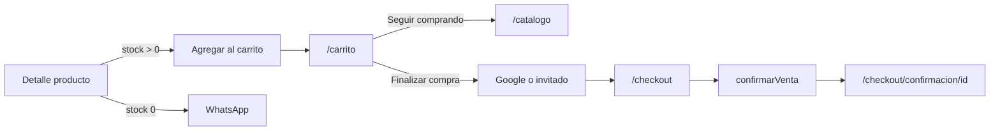

# Etapa 2 — Carrito de compras y comercio (web-aukan)

Documentación de lo implementado en la **Etapa 2**. Complementa el [README](../README.md), [DER.txt](../DER.txt) y [FUTUROS-CAMBIOS.md](./FUTUROS-CAMBIOS.md).

**Fecha:** julio 2026  
**Migración Prisma:** `prisma/migrations/20260713180000_etapa2_comercio`

---

## 1. Resumen

La Etapa 2 reemplaza el flujo “solo consultar por WhatsApp” por un **carrito + checkout** que registra ventas en la base. MercadoPago queda para la **Etapa 3** (los pagos se crean en estado `pendiente`).

| Capacidad | Detalle |
|-----------|---------|
| Carrito | Cookie `cart` + server actions; redirect a `/carrito` al agregar |
| Checkout | Invitado o Google; envío a domicilio o retiro en tienda |
| Persistencia | `cliente`, `direccion`, `venta`, `venta_detalle`, `pago`, `envio` |
| Stock | Se descuenta en transacción al confirmar |
| WhatsApp | Solo si el producto tiene stock 0 (o sin precio) |
| Auth shop | Google para clientes; admin sigue restringido a `tipo_usuario=admin` |
| Admin | Menú **Ventas** con filtros y detalle |

---

## 2. Modelo de datos

### 2.1 Refactor de `usuario`

Quedó **mínimo** (auth):

| Campo | Notas |
|-------|--------|
| `id_usuario` | PK |
| `mail` | Unique |
| `tipo_usuario` | `admin` \| `cliente` |
| `activo` | Boolean |
| `fecha_hora_registro` | Default now |

Los datos personales y de domicilio pasaron a `cliente` / `direccion`. La migración SQL migró filas `tipo_usuario = 'cliente'` antes de dropear columnas.

### 2.2 Tablas nuevas

```
usuario (mínimo)
    │ 0..1
    ▼
cliente ──1──► direccion (varias; una puede ser principal)
    │
    ▼
venta ──┬──► venta_detalle (ítems con snapshot de precio/nombre)
        ├──► pago
        └──► envio (solo si tipo_entrega = envio) ──► direccion
```

**`cliente`:** `id_cliente`, `id_usuario` (nullable), `id_direccion_principal` (nullable), `nombre`, `apellido`, `mail` (unique), `tipo_documento`, `numero_documento`, `telefono`, `fecha_hora_registro`.

**`direccion`:** `id_direccion`, `id_cliente`, `calle`, `numero`, `piso`, `departamento`, `barrio`, `localidad`, `provincia`, `pais`, `codigo_postal`, `latitud`, `longitud`, `referencias`.

**`venta`:** `id_venta`, `id_cliente`, `fecha_hora`, `estado` (`pendiente` al crear), `tipo_entrega` (`envio` \| `retiro`), `subtotal`, `descuento`, `costo_envio`, `total`.

**`venta_detalle`:** PK (`id_venta`, `item`), `id_producto`, `nombre_producto`, `cantidad`, `precio_unitario`, `subtotal`.

**`pago`:** `id_pago`, `id_venta`, `tipo_pago` (`tienda` \| `online`), `estado` (`pendiente`), `monto`, `referencia`, `transaction_id` (para MP en Etapa 3).

**`envio`:** `id_envio`, `id_venta`, `tipo`, `estado`, `id_direccion`, `tracking`.

### 2.3 Impacto en admin usuarios

`/admin/usuarios` solo edita mail, tipo y activo. Los clientes de comercio viven en `cliente`.

---

## 3. Flujo de compra (sitio público)



### 3.1 Carrito

| Pieza | Ubicación |
|-------|-----------|
| Cookie + helpers | [`src/lib/cart.ts`](../src/lib/cart.ts) |
| Actions | [`src/app/(shop)/carrito/actions.ts`](../src/app/(shop)/carrito/actions.ts) |
| Página | [`src/app/(shop)/carrito/page.tsx`](../src/app/(shop)/carrito/page.tsx) |

- Cookie HTTP-only `cart`: `[{ id_producto, cantidad }]`.
- Actions: `addToCart` (redirige a `/carrito`), `updateQuantity`, `removeFromCart`, `clearCart`.
- Validación contra stock total (suma de almacenes).
- UI: ítems, cantidades, total; **Seguir comprando** / **Finalizar compra**.

### 3.2 Detalle de producto

[`src/app/(shop)/catalogo/[id]/page.tsx`](../src/app/(shop)/catalogo/[id]/page.tsx):

- Stock > 0 y precio → form cantidad + **Agregar al carrito**.
- Caso contrario → **Consultar por WhatsApp**.

### 3.3 Checkout e identidad

| Pieza | Ubicación |
|-------|-----------|
| Gate Google / invitado | [`src/app/(shop)/checkout/page.tsx`](../src/app/(shop)/checkout/page.tsx) |
| Actions identidad | [`src/app/(shop)/checkout/identity-actions.ts`](../src/app/(shop)/checkout/identity-actions.ts) |
| Confirmar venta | [`src/app/(shop)/checkout/actions.ts`](../src/app/(shop)/checkout/actions.ts) |
| Campos entrega | [`src/components/checkout-delivery-fields.tsx`](../src/components/checkout-delivery-fields.tsx) |
| Confirmación | [`src/app/(shop)/checkout/confirmacion/[id]/page.tsx`](../src/app/(shop)/checkout/confirmacion/[id]/page.tsx) |

**Gate:** al ir a `/checkout` sin sesión y sin `?modo=invitado` → elegir **Continuar con Google** o **Continuar como invitado**.

**Google:** crea/vincula `usuario` + `cliente`; si el cliente ya existe, precarga datos y dirección principal. Mail en solo lectura.

**Invitado:** formulario vacío (`?modo=invitado`).

**Dirección (envío):** obligatorios solo `calle`, `numero`, `localidad`, `provincia` (select de provincias AR). Resto opcional.

**Documento:** select DNI (default) / CUIT.

**Entrega / pago:**

| Entrega | Pago |
|---------|------|
| Envío a domicilio | Siempre `online` (pendiente hasta Etapa 3) |
| Retiro en tienda | `tienda` u `online` (ambos pendientes) |

**`confirmarVenta` (transacción):** revalida stock/precio → upsert `cliente` → crea `direccion` si envío → `venta` + detalle + `pago` (+ `envio`) → descuenta stock → limpia cookie → redirect a confirmación.

`costo_envio = 0` por ahora (campo listo para tarifas).

---

## 4. Auth (cambios Etapa 2)

Archivo: [`src/auth.ts`](../src/auth.ts).

| Antes (Etapa 1) | Ahora |
|-----------------|-------|
| Google solo si el mail es admin activo | Google permitido para cualquier cuenta con mail |
| Sesión solo útil para `/admin` | Clientes del shop también inician sesión |
| — | Al login Google se asegura `usuario` + `cliente` |

El **panel admin** sigue protegido por [`src/proxy.ts`](../src/proxy.ts): `role === "admin"`.

### Header / cuenta

- [`src/components/site-chrome.tsx`](../src/components/site-chrome.tsx): carrito con badge; **Iniciar sesión** o menú **Cuenta** (mail, cerrar sesión, **Panel admin** si admin).
- [`src/app/(shop)/cuenta/page.tsx`](../src/app/(shop)/cuenta/page.tsx): login Google / resumen de cuenta.

---

## 5. Admin — Ventas

| Ruta | Qué hace |
|------|----------|
| `/admin/ventas` | Listado |
| `/admin/ventas/[id]` | Detalle |

Filtros:

- **Desde / hasta** (default: última semana).
- **Tipo de entrega:** envío / retiro / todos.
- **Estado:** pendiente, confirmada, cancelada, entregada / todos.
- Paginación de **20**.

Detalle compacto: cliente, pedido, dirección de envío (si aplica), ítems y totales.

Link en menú: [`src/app/admin/layout.tsx`](../src/app/admin/layout.tsx).

---

## 6. Archivos clave tocados / creados

### Nuevos

- `src/lib/cart.ts`
- `src/app/(shop)/carrito/page.tsx`, `actions.ts`
- `src/app/(shop)/checkout/page.tsx`, `actions.ts`, `identity-actions.ts`
- `src/app/(shop)/checkout/confirmacion/[id]/page.tsx`
- `src/app/(shop)/cuenta/page.tsx`
- `src/components/checkout-delivery-fields.tsx`
- `src/app/admin/ventas/page.tsx`, `[id]/page.tsx`
- `prisma/migrations/20260713180000_etapa2_comercio/`

### Modificados (principales)

- `prisma/schema.prisma`, `prisma/seed.ts`
- `src/auth.ts`
- `src/app/(shop)/catalogo/[id]/page.tsx`
- `src/components/site-chrome.tsx`
- `src/app/admin/layout.tsx`, `actions.ts`, `usuarios/*`
- `src/app/globals.css`

---

## 7. Cómo probar

1. `npx prisma migrate deploy` (si aún no aplicaste la migración Etapa 2).
2. Opcional: `npm run db:seed`.
3. `npm run dev`.
4. Catálogo → producto con stock → **Agregar al carrito** → debe ir a `/carrito`.
5. **Finalizar compra** → Google o invitado → confirmar → ver `/checkout/confirmacion/{id}`.
6. Admin → **Ventas** → filtrar y abrir detalle.
7. Producto sin stock → debe verse WhatsApp.

---

## 8. Fuera de alcance (Etapa 3+)

- Integración **MercadoPago** (`pago.transaction_id`, cambiar `pago.estado`).
- Tarifas reales de envío / tracking operativo.
- Cambio de estado de venta desde el admin (hoy solo lectura).
- Mails transaccionales.
- Historial de pedidos en cuenta del cliente.
- CSS / branding definitivo de marca.

---

## 8.1 Integración Odoo (posterior a Etapa 2)

Al aprobarse el pago en Mercado Pago, la venta se sincroniza a Odoo (partner, sale.order Ecommerce `OCWN-*`, recibo).

**Documentación completa:** [ODOO-CHECKOUT.md](./ODOO-CHECKOUT.md)

---

## 9. Notas operativas

- Google OAuth debe incluir redirect `.../api/auth/callback/google` (shop y admin usan el mismo provider).
- Tras deploy: `npx prisma migrate deploy`.
- El seed borra también ventas/pagos/envíos/clientes/direcciones antes de recrear datos demo.

---

*Documento de cierre Etapa 2 — julio 2026. Checkout → Odoo: [ODOO-CHECKOUT.md](./ODOO-CHECKOUT.md).*
