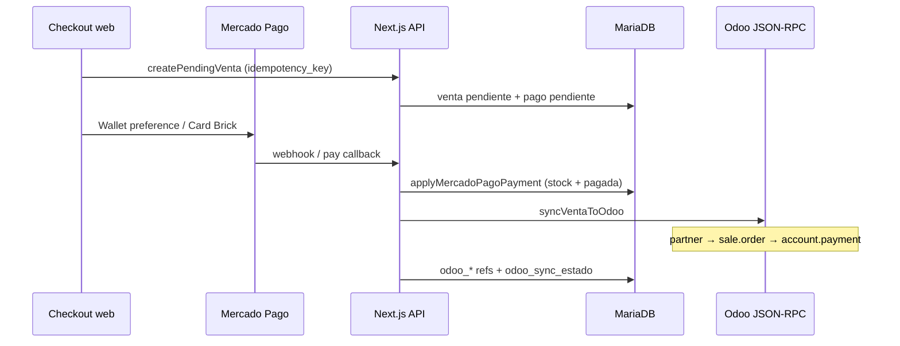

# Checkout → Odoo — documentación de integración

Documento de referencia para modificar, probar o depurar el flujo **pago web → venta en Odoo**.

**Última actualización:** 2026-08-11  
**Instancias usadas en pruebas:**
- Producción: `https://oneclick.adhoc.ar`
- Test / training: `https://train-oneclick-24-07-1.adhoc.inc`

---

## 1. Objetivo

Cuando Mercado Pago aprueba un pago, la web debe:

1. Marcar la venta como `pagada` y descontar stock local del almacén destino.
2. Crear / reutilizar en Odoo, de forma **idempotente**:
   - Cliente (`res.partner`)
   - Orden de venta Ecommerce (`sale.order`, nombre `OCWN-<id_venta>`)
   - Recibo de cobro (`account.payment`, `memo` = ID de operación MP)

La factura electrónica **no** se genera desde la web (queda a cargo de Odoo / procesos internos).

---

## 2. Flujo end-to-end



### Puntos de entrada

| Momento | Archivo / ruta |
|---------|----------------|
| Crear venta pendiente | [`checkout-venta.ts`](../src/lib/checkout-venta.ts) → `createPendingVenta` |
| Preferencia MP (Wallet / Checkout Pro) | [`api/mercadopago/preference`](../src/app/api/mercadopago/preference/route.ts) (+ helper [`mp-preference.ts`](../src/lib/mp-preference.ts)); fallback form [`checkout/actions.ts`](../src/app/(shop)/checkout/actions.ts) |
| Pago tarjeta embebido (Card Brick) | [`api/mercadopago/pay`](../src/app/api/mercadopago/pay/route.ts) |
| Webhook MP | [`api/mercadopago/webhook`](../src/app/api/mercadopago/webhook/route.ts) |
| Aplicar pago + disparar Odoo | [`mp-payment-sync.ts`](../src/lib/mp-payment-sync.ts) → `applyMercadoPagoPayment` |
| Orquestador Odoo | [`odoo-venta.ts`](../src/lib/odoo-venta.ts) → `syncVentaToOdoo` |
| Reintento admin | `POST /api/admin/odoo/sync-venta` |
| Reintento CLI | `npm run sync:ventas` |

### Checkout: modo de cobro × mecanismo

UI en [`checkout-payment-options.tsx`](../src/components/checkout-payment-options.tsx):

1. **Modo:** Contado (`tipo_pago=mercado_pago`, 1 cuota) o Cuotas (`tipo_pago=tarjeta`, hasta `cartMaxInstallments`).
   - El descuento contado **no** es un 10% fijo: solo aplica a productos con `cuotas_max` definido y `>=` parámetro `cantidad_cuotas_base_descuento_contado`, con el % de `porcentaje_descuento_contado_segun_cuota` (grupo `precios`). Ver §4.3.
2. **Mecanismo:** Mercado Pago con login (Wallet Brick / preference `purpose=wallet_purchase`) o Card Payment Brick en el sitio.

Ambos mecanismos están disponibles en ambos modos. La preference de cuotas **no** fuerza `installments: 1`. Datos de payer / `additional_info` / Device ID: [`mp-payer-payload.ts`](../src/lib/mp-payer-payload.ts).


---

## 3. Archivos clave

| Archivo | Rol |
|---------|-----|
| [`odoo.ts`](../src/lib/odoo.ts) | Cliente JSON-RPC (credenciales env + retries ante corte de socket) |
| [`odoo-write.ts`](../src/lib/odoo-write.ts) | Create / write / search con contexto de compañía |
| [`odoo-config.ts`](../src/lib/odoo-config.ts) | IDs de integración desde tabla `parametro` (grupo `odoo`) |
| [`odoo-venta.ts`](../src/lib/odoo-venta.ts) | Partner, sale.order, receipt, sync orquestado |
| [`odoo-stock.ts`](../src/lib/odoo-stock.ts) | Stock live en Odoo antes de cobrar / antes de sync |
| [`almacenes.ts`](../src/lib/almacenes.ts) | Almacenes vendibles (retiro / envío) |
| [`odoo-sync.ts`](../src/lib/odoo-sync.ts) | Sync de catálogo (incluye `id_tienda` y `es_envio_domicilio`) |
| [`mp-payment-sync.ts`](../src/lib/mp-payment-sync.ts) | Idempotencia del pago + trigger Odoo |
| [`checkout-venta.ts`](../src/lib/checkout-venta.ts) | Validaciones checkout (tienda, stock local + Odoo); `computeTotals` (descuento contado por ítem elegible) |
| [`pricing.ts`](../src/lib/pricing.ts) | Elegibilidad contado (`productoCalificaDescuentoContado`) y factor % |
| [`parametros.ts`](../src/lib/parametros.ts) | `getDescuentoContadoConfig()` + envíos |
| [`checkout-order-summary.tsx`](../src/components/checkout-order-summary.tsx) | Sidebar “Tu pedido”: tachado + fila descuento según modo Contado/Cuotas |
| [`test-checkout-odoo.ts`](../scripts/test-checkout-odoo.ts) | Prueba E2E sin Mercado Pago (`--envio`, `--cupon`, `--regalo`) |

---

## 4. Configuración

### 4.1 Credenciales (`.env` — no van a la DB)

Solo conexión:

```env
ODOO_URL=https://oneclick.adhoc.ar          # o train-oneclick-24-07-1.adhoc.inc
ODOO_DB=odoo
ODOO_UID=21                                 # id numérico de res.users (URL del usuario)
ODOO_API_KEY=...                            # clave API del usuario (preferencias Odoo)
```

Cómo obtener `UID` / `DB` / `API_KEY`: ver sección §9.

### 4.2 IDs de integración (tabla `parametro`, grupo `odoo`)

**No** están en `.env`. Se editan en **Admin → Parámetros** o con:

```bash
npm run seed:odoo-params   # inserta defaults
# o
npm run db:seed            # incluye seed Odoo
```

| Parámetro | Default | Uso |
|-----------|---------|-----|
| `odoo_company_id` | `1` | Oneclick Argentino SRL |
| `odoo_sale_order_type_id` | `38` | Tipo pedido Ecommerce |
| `odoo_sale_team_id` | `2` | Equipo WEB |
| `odoo_pricelist_id` | `9` | Promociones Vigentes (ARS) |
| `odoo_fiscal_position_id` | `16` | Venta Bs de Uso |
| `odoo_payment_term_id` | `1` | Contado |
| `odoo_currency_id` | `20` | ARS |
| `odoo_payment_journal_id` | `104` | Diario Mercado Pago |
| `odoo_payment_method_line_id` | `174` | Línea método de pago |
| `odoo_receiptbook_id` | `2` | Talonario recibos |
| `odoo_shipping_product_id` | `8255` | Producto “Envío a Domicilio” |
| `odoo_discount_product_id` | `57081` | Producto “Descuento Web” (línea negativa de cupón) |
| `odoo_order_prefix` | `OCWN` | Nombre orden `OCWN-<id_venta>` |
| `odoo_id_type_dni` / `odoo_id_type_cuit` | `5` / `4` | Tipos identificación |
| `odoo_afip_cf` / `odoo_afip_ri` | `5` / `1` | Responsabilidad AFIP |
| `odoo_country_ar` | `10` | Argentina |
| `odoo_create_invoice` | `false` | No crear factura desde web |
| `odoo_sync_enabled` | `true` | Flag de negocio |
| `odoo_sync_max_intentos` | `5` | Tope reintentos CLI |

`isOdooSyncEnabled()` = `odoo_sync_enabled` **y** credenciales presentes en env.

Cache de config: 60s en memoria; se invalida al editar parámetros del grupo `odoo` en admin.

> **Importante al cambiar de prod ↔ test:** los IDs de journals / type / product pueden diferir. Verificarlos en la instancia destino y actualizar el grupo `odoo` en MySQL.

### 4.3 Descuento contado (tabla `parametro`, grupo `precios`)

Ya **no** hay un 10% fijo para todo el carrito. El descuento depende de `producto.cuotas_max` y de estos parámetros (Admin → Parámetros; también en `db:seed`):

| Parámetro | Default | Uso |
|-----------|---------|-----|
| `cantidad_cuotas_base_descuento_contado` | `12` | Umbral: el producto califica si `cuotas_max` está definido, `> 0` y `>=` este valor |
| `porcentaje_descuento_contado_segun_cuota` | `20` | % a aplicar (20 = 20%) |

Reglas:

1. Sin `cuotas_max` (null / ≤0) → **sin** descuento contado (el fallback visual `?? 12` de ficha/cards **no** cuenta para elegibilidad).
2. Contado (`tipo_pago=mercado_pago`): en `computeTotals` el % se aplica **solo** a ítems elegibles; el resto va a precio lista/promo.
3. Carrito mixto: descuento parcial; toda la compra sigue siendo 1 pago.
4. Cupón: se aplica **después** del descuento contado, sobre el subtotal de productos (no sobre el envío).
5. Odoo recibe `precio_cobrado` ya neto (`discount: 0` en líneas).

UI: ficha/cards muestran el texto solo si califica; en checkout, “Tu pedido” refleja Contado (tachado + fila descuento) o Cuotas vía evento `oc-modo-cobro`.

Helpers: `getDescuentoContadoConfig()`, `productoCalificaDescuentoContado()`, `factorDescuentoContado()`.

---

## 5. Almacenes vendibles

Configuración en tabla `almacen` (no en env):

| Criterio | Significado |
|----------|-------------|
| `id_tienda IS NOT NULL` | Sucursal de retiro (odoo_ids típicos: 1, 7, 8, 9, 10, 11) |
| `es_envio_domicilio = true` | Almacén de envío a domicilio (código Odoo `WH`, odoo_id típico **14**) |

El sync de almacenes (`syncAlmacenes`) setea:
- `id_tienda` vía mapa slug (Alto Rosario, Palermo, etc.)
- `es_envio_domicilio` cuando `code === "WH"`

Helpers: `isSellableAlmacen`, `getShippingWarehouseOdooId`, `getStoreWarehouseOdooIds`.

### Resolución de almacén en una venta

| `tipo_entrega` | Almacén Odoo |
|----------------|--------------|
| `envio` | `getShippingWarehouseOdooId()` (flag `es_envio_domicilio`) |
| `retiro` | `almacen` con `id_tienda = id_tienda_retiro` |

El selector de tienda en checkout solo lista tiendas con stock completo del carrito (`/api/checkout/tiendas-disponibles`).

---

## 6. Campos persistidos en `venta` / relacionados

| Campo | Uso |
|-------|-----|
| `idempotency_key` | Evita ventas duplicadas en dobles submits |
| `id_tienda_retiro` | Tienda elegida (retiro) |
| `odoo_warehouse_id` | Almacén destino Odoo |
| `odoo_partner_id` | `res.partner` |
| `odoo_order_id` / `odoo_order_name` | `sale.order` |
| `odoo_payment_id` / `odoo_payment_name` | `account.payment` |
| `odoo_sync_estado` | `pendiente` \| `en_proceso` \| `ok` \| `error` |
| `odoo_sync_error` | Último error |
| `odoo_sync_intentos` | Contador |
| `odoo_sync_at` | Timestamp OK |
| `cliente.odoo_partner_id` | Partner reutilizable |
| `pago.transaction_id` | ID operación MP (unique) |
| `venta_detalle.precio_cobrado` | Precio bruto efectivamente cobrado |

---

## 7. Idempotencia

1. **Checkout:** `venta.idempotency_key` unique → reusa venta pendiente.
2. **Pago MP:** si `pago.estado === "aprobado"` no vuelve a descontar stock.
3. **Odoo claim:** `updateMany` con `odoo_sync_estado in (pendiente, error)` → `en_proceso`.
4. **Partner:** busca por VAT/DNI o email antes de crear.
5. **Orden:** busca `name = OCWN-<id>` antes de crear.
6. **Recibo:** busca `memo = <mp_transaction_id>` antes de crear.

---

## 8. Lógica de precios / impuestos en la orden Odoo

Los precios de la web son **brutos** (IVA incluido). Al armar líneas:

1. Se leen impuestos del producto en Odoo.
2. Se filtran a **un solo IVA AR** (21% o 10.5%) — en instancias de test a veces hay impuestos duplicados (21+19, 19+10.5).
3. Se convierte a neto: `price_unit = bruto / (1 + tasa)`.
4. La pricelist “Promociones Vigentes” puede aplicar descuentos; tras crear la orden se fuerza `discount = 0` y el `price_unit` cobrado.
5. Se valida `|total_odoo − total_venta| ≤ 1`. El total cobrado en MP ya se alinea en checkout al redondeo global de Odoo (`alignGrossesToOdooTotal` en `odoo-amount.ts`); no se ajusta el `price_unit` neto post-create.

### Cupón de descuento

Si la venta tiene `id_cupon` / `cupon`:

1. Las líneas de producto usan el **precio cobrado** (`precio_cobrado`, ya con cupón + contado aplicados).  
   - En Odoo `sale.order.line` **solo existe** `discount` (%). **No hay** campo de descuento por monto fijo en la línea.
   - Por eso **no** usamos la columna `% Descuento` ni una línea de cupón: el monto queda absorbido en el `price_unit` cobrado (mismo total que Mercado Pago).
2. El cupón se registra en **`internal_notes`** de la `sale.order` (ej. `Cupón web TESTCUP…: −$5.000,00`).
3. El envío **no** se descuenta con el cupón (igual que en checkout web).
4. `amount_total` Odoo = `venta.total` (= monto MP).

Envío (`tipo_entrega = envio` y `costo_envio > 0`): línea con producto `odoo_shipping_product_id`, IVA 21% (tax id 116).

No usar `sale.order.note` (es “Términos y condiciones”). Retiro / receptor / referencias → `internal_notes` + `stock.picking.note`. Cupón web → `internal_notes`. En retiro, `partner_shipping_id` = contacto **delivery hijo de Oneclick Argentino SRL** (display `Oneclick Argentino SRL, OneClick Córdoba Shopping`), no el `partner_id` del almacén (ese apunta a Tránsito entre almacenes) ni el del cliente.

---

## 9. Credenciales Odoo — dónde encontrarlas

| Variable | Dónde |
|----------|-------|
| `ODOO_URL` | URL base de la instancia (sin `/web`) |
| `ODOO_DB` | Nombre de la base; si hay una sola suele ser `odoo`. Preguntar a Adhoc en training. |
| `ODOO_UID` | Abrir el usuario en Odoo → URL `...id=21&model=res.users...` → ese número |
| `ODOO_API_KEY` | Usuario → Mis preferencias → Seguridad → Claves API → Nueva |

Verificar conexión:

```bash
npx tsx scripts/inspect-odoo.ts
```

---

## 10. Sync de catálogo (contexto)

```bash
npm run sync:odoo
npm run sync:odoo -- --skip-images   # rápido
npm run sync:odoo -- --skip-stock
```

**Problema conocido / fix:** pedir `image_1920` en páginas de 200 productos tumba el proxy (~35 MB → `SocketError: other side closed`).  
Solución actual: metadatos sin imágenes + descarga de imágenes en lotes de 5 + retries en `odoo.ts`.

---

## 11. Pruebas sin Mercado Pago

Script: [`scripts/test-checkout-odoo.ts`](../scripts/test-checkout-odoo.ts)

```bash
# Retiro en tienda (cliente nuevo, pago simulado, sync Odoo)
npm run test:checkout-odoo

# Envío a domicilio
npm run test:checkout-odoo -- --envio

# Envío + cupón de $5000 (línea negativa en la sale.order)
npm run test:checkout-odoo -- --envio --cupon 5000

# Solo cupón (retiro), monto custom
npm run test:checkout-odoo -- --cupon 3000

# Regalo por monto (línea producto price_unit=0 en la sale.order)
npm run test:checkout-odoo -- --regalo
npm run test:checkout-odoo -- --envio --regalo

# Reintentar sync de una venta ya pagada
npm run test:checkout-odoo -- --venta-id 8
```

El script:
1. Crea cliente + venta + detalle + pago pendiente (+ envío / cupón / **regalo $0** según flags).
2. Llama `applyMercadoPagoPayment` con un payment mock (`TEST-MP-...`) y `syncOdoo: false`.
3. Ejecuta `syncVentaToOdoo` de forma síncrona y muestra refs Odoo + líneas de la orden.

Detalle de regalos: [REGALOS.md](./REGALOS.md).

Pruebas exitosas (2026-07-28, instancia training):

| Venta | Tipo | Orden | Recibo | Notas |
|-------|------|-------|--------|-------|
| #4 | retiro Córdoba (WH 10) | `OCWN-4` | `RE-X 0001-00121925` | |
| #7 | envío WH 14 | `OCWN-7` | `RE-X 0001-00121926` | |
| #8 | envío + cupón $5000 | `OCWN-8` | `RE-X 0001-00121927` | Total Odoo = MP \$33587.77; línea `Cupón TESTCUP…` |
| #12 | retiro + **regalo** $0 | `OCWN-12` | `RE-X 0001-00121929` | Línea `[409912186] … (Regalo)` con `price_unit=0`; total match |

---

## 12. Errores frecuentes y qué mirar

| Síntoma | Causa probable | Qué hacer |
|---------|----------------|-----------|
| `SocketError / other side closed` en sync catálogo | Respuesta demasiado grande (imágenes) | Usar `--skip-images` o confiar en lotes chicos actuales |
| `odoo_sync_estado = skipped` / `en_proceso` trabado | Doble claim o crash a mitad | Resetear a `pendiente` y `npm run test:checkout-odoo -- --venta-id N` |
| `Unique constraint cliente_odoo_partner_id` | Mismo DNI/partner ya linkeado a otro cliente local | Usar DNI/mail únicos en pruebas |
| `Longitud invalida para DNI` | DNI con ≠ 7–8 dígitos | Ajustar documento |
| `Total Odoo no coincide` | Impuestos duplicados o descuento de pricelist | Ver §8; ya hay filtro IVA + force discount 0 |
| Sync `disabled` | Sin API key / `odoo_sync_enabled=false` | Revisar `.env` y parámetros |
| Stock insuficiente Odoo | Almacén sin stock real en test/prod | Elegir otro producto/tienda o sync stock |

Estados visibles:
- Confirmación shop: [`checkout/confirmacion/[id]`](../src/app/(shop)/checkout/confirmacion/[id]/page.tsx)
- Admin venta: [`admin/ventas/[id]`](../src/app/admin/ventas/[id]/page.tsx) + botón reintento

---

## 13. Checklist al modificar el flujo

1. ¿Cambió un ID de Odoo? → actualizar `parametro` grupo `odoo` (no `.env`).
2. ¿Nuevo almacén de retiro? → mapear slug en `odoo-sync.ts` (`TIENDA_SLUG_BY_WAREHOUSE_ODOO_ID`) y asegurar tienda en seed.
3. ¿Nuevo almacén de envío? → marcar `es_envio_domicilio = true` (y código `WH` en sync).
4. ¿Cambio de impuestos / precios? → revisar `pickSaleTaxes` + force discount en `odoo-venta.ts`.
5. ¿Nuevo campo en venta? → schema Prisma + migración + `loadVentaForOdoo`.
6. Probar:
   ```bash
   npm run test:checkout-odoo
   npm run test:checkout-odoo -- --envio
   npm run test:checkout-odoo -- --regalo
   ```
7. Documentar en este archivo si cambia un contrato (nombre orden, memo, tipo pedido, etc.).
8. ¿Línea de regalo? → ver [REGALOS.md](./REGALOS.md); no filtrar `price_unit=0` ni usarla en el ajuste de redondeo.

---

## 14. Referencias Odoo verificadas (prod)

Orden de referencia Woo legacy: `sale.order` 156122 = `OCW-212217`

| Campo | Valor |
|-------|-------|
| `type_id` | 38 (Ecommerce) |
| `team_id` | 2 (WEB) |
| `user_id` | ApiSync (`ODOO_UID`); se fuerza aunque el partner tenga otro Comercial |
| `warehouse_id` (envío) | 14 (`WH` / Warehouse) |
| Sucursales retiro | 1, 7, 8, 9, 10, 11 |
| Recibo ejemplo | journal 104, method line 174, receiptbook 2 |
| Prefijo web nueva | `OCWN-` (para no chocar con `OCW-` Woo) |

---

## 15. Relación con otros docs

- Estado general: [ESTADO-PROYECTO.md](./ESTADO-PROYECTO.md)
- Carrito / checkout UI: [ETAPA-2-CARRITO.md](./ETAPA-2-CARRITO.md)
- Parámetros de envío (precios FastTrack/SmartPost): Admin → Parámetros grupo `envios` / [`parametros.ts`](../src/lib/parametros.ts)
- Descuento contado por cuotas: Admin → Parámetros grupo `precios` / §4.3
