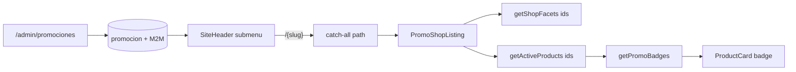

# Promociones dinámicas (menú + listado + admin)

Documentación de la feature de **promociones del menú principal** para futuros cambios.

**Referencia live:** [oneclickstore.com — menú Promociones](https://www.oneclickstore.com/) (ej. [Vacaciones de Invierno](https://www.oneclickstore.com/vacaciones-de-invierno/))  
**Última actualización:** 2026-07-25

---

## 1. Qué hace

1. El submenú **Promociones** del header se arma desde la tabla `promocion` (no hardcode).
2. Cada promo tiene URL pública `/{slug}` (ej. `/vacaciones-de-invierno`).
3. Al entrar, se listan los productos de la promo (categorías y/o productos asociados) con **sidebar de filtros** como `/shop`.
4. Si la promo tiene `etiqueta_imagen`, esa imagen se superpone en la esquina superior derecha de las `ProductCard` de productos incluidos.
5. Todo se administra en `/admin/promociones`.

---

## 2. Modelo de datos

Definido en [`prisma/schema.prisma`](../prisma/schema.prisma).

### `promocion`

| Campo | Tipo | Uso |
|-------|------|-----|
| `id_promocion` | PK | |
| `nombre` | string | Texto grande del menú (“Vacaciones de Invierno”) |
| `subtitulo` | string? | Kicker naranja encima del nombre (“Promo!”, “Nuevo!”) |
| `icono` | string? | Emoji/texto **o** path de imagen en `uploads/promos/` |
| `etiqueta_imagen` | string? | Badge PNG/WebP para la card (path en `uploads/promos/`) |
| `prioridad` | int | Orden en el menú (**menor = primero**) |
| `slug` | unique | Segmento de URL → `/{slug}` |
| `activo` | bool | Solo activas van al menú y a listados públicos |

### Relaciones M2M

- `promocion_categoria` → `(id_promocion, id_categoria)`
- `promocion_producto` → `(id_promocion, id_producto)`

**Resolución de productos de una promo** (`resolvePromoProductIds` en [`src/lib/promos.ts`](../src/lib/promos.ts)):

```
unión(
  productos asociados directo,
  productos de categorías asociadas + descendientes
)
```

Los descendientes reutilizan `resolveCategoryFilterIds` de [`src/lib/products.ts`](../src/lib/products.ts).

### Migración / seed

- Migración SQL: `prisma/migrations/20260725120000_promociones/`
- En entornos sin historial de migrate: `npx prisma db push`
- Seed (`prisma/seed.ts`): upsert de las promos base del menú (Vacaciones de Invierno, BOMBA, Ofertas Apple, Outlet, Hasta 24/18/12 cuotas). Las asociaciones categorías/productos se configuran en admin.

---

## 3. Archivos clave

| Rol | Path |
|-----|------|
| Queries / nav / badges | [`src/lib/promos.ts`](../src/lib/promos.ts) |
| Listados + facetas con `ids` | [`src/lib/products.ts`](../src/lib/products.ts) (`getActiveProducts`, `getShopFacets`) |
| Item Promociones en nav | [`src/lib/nav.ts`](../src/lib/nav.ts) (`dynamicChildren: "promociones"`) |
| Header (carga promos) | [`src/components/site-chrome.tsx`](../src/components/site-chrome.tsx) |
| Listado promo + filtros | [`src/components/promo-shop-listing.tsx`](../src/components/promo-shop-listing.tsx) |
| Catch-all (promo vs categoría) | [`src/app/(shop)/[...path]/page.tsx`](../src/app/(shop)/[...path]/page.tsx) |
| Índice “Shop Promo →” | [`src/app/(shop)/promo/page.tsx`](../src/app/(shop)/promo/page.tsx) |
| Querystring filtros | [`src/lib/shop-query.ts`](../src/lib/shop-query.ts) (`buildShopHref(..., basePath)`) |
| Sidebar / toolbar / precio | `shop-sidebar.tsx`, `shop-toolbar.tsx`, `shop-price-slider.tsx` (`basePath` opcional) |
| Badge en card | [`src/components/product-card.tsx`](../src/components/product-card.tsx) + `.oc-product-card-promo-badge` en `globals.css` |
| Admin listado | [`src/app/admin/promociones/page.tsx`](../src/app/admin/promociones/page.tsx) |
| Admin alta | [`src/app/admin/promociones/nuevo/page.tsx`](../src/app/admin/promociones/nuevo/page.tsx) |
| Admin edición | [`src/app/admin/promociones/[id]/page.tsx`](../src/app/admin/promociones/[id]/page.tsx) |
| Server Actions | [`src/app/admin/promociones/actions.ts`](../src/app/admin/promociones/actions.ts) |
| Link en nav admin | [`src/app/admin/layout.tsx`](../src/app/admin/layout.tsx) |

---

## 4. Flujo público



### Menú

1. `MAIN_NAV` marca el ítem Promociones con `dynamicChildren: "promociones"` y `children: []`.
2. `SiteHeader` llama `getActivePromosNav()` y arma children:
   - `label` = `nombre`
   - `badge` = `subtitulo` (clase `.oc-pill-badge`)
   - `href` = `/{slug}`
   - `icon` = emoji o `` si `isPromoIconImage(icono)`
3. CTA del panel: **Shop Promo →** → `/promo` (índice de promos activas).

### Ruta `/{slug}`

En el catch-all, **si hay un solo segmento**, se busca primero `promocion` activa por slug. Si existe → `PromoShopListing`. Si no → categoría como antes.

**Importante:** el slug de una promo no debe colisionar con una categoría de un solo segmento que se quiera servir como categoría (la promo gana). Ejemplos seed: `outlet-promo` (no `outlet`), `vacaciones-de-invierno`, `hasta-24-cuotas`, etc.

### Filtros

Los filtros reusan el shop pero con `basePath = /{slug}`:

- `/vacaciones-de-invierno?cat=iphone&marca=apple&min=...&orden=precio-asc&page=2`

`buildShopHref(query, patch, basePath)` en `shop-query.ts`.

### Badge en card

- `ProductListItem.promoBadge`
- `getActiveProducts` adjunta badges vía `getPromoBadges` (promo activa de **menor prioridad** que tenga `etiqueta_imagen` y contenga al producto).
- CSS: `.oc-product-card-promo-badge`; el wishlist se baja con `:has(.oc-product-card-promo-badge)`.

---

## 5. Panel admin

Patrón igual al resto del admin:

| Ruta | Contenido |
|------|-----------|
| `/admin/promociones` | Tabla compacta + botón **Crear** |
| `/admin/promociones/nuevo` | Formulario de alta (nombre, subtítulo, icono texto/imagen, etiqueta, prioridad, slug) |
| `/admin/promociones/[id]` | Edición + categorías (checkboxes) + productos (buscar/agregar/quitar) + eliminar |

Tras crear, `createPromocion` redirige a `/admin/promociones/{id}`.

Uploads: `saveUploadedFile(file, "promos")` → paths tipo `promos/{uuid}.png`.

`revalidatePath`: `/admin/promociones`, `/`, `/{slug}`.

---

## 6. Cómo hacer cambios frecuentes

### Agregar / editar una promo de negocio

Usar el admin. No hace falta tocar código ni redeploy si solo cambian datos.

### Cambiar orden del menú

Editar **Prioridad** (número menor = más arriba).

### Cambiar qué productos aparecen

En la edición: marcar categorías y/o agregar productos sueltos. La unión de ambos define el listado.

### Cambiar el badge de la card

Subir/quitar `etiqueta_imagen` en la edición. Solo se muestra en productos que caen dentro de esa promo.

### Nuevo campo en `promocion`

1. `schema.prisma` + migración / `db push`
2. Forms `nuevo` y `[id]`
3. Actions `createPromocion` / `updatePromocion`
4. Si afecta menú o listado: `promos.ts` / `site-chrome` / `promo-shop-listing`

### Cambiar UI del mega-menú de promos

`site-chrome.tsx` + clases `.oc-pill-*` / `.oc-pill-panel-icon*` en `globals.css`.

### Cambiar layout del listado de promo

`promo-shop-listing.tsx` (misma estructura que `/shop`).

---

## 7. Checklist de verificación

- [ ] Admin: crear promo → redirige a edición
- [ ] Asociar categoría y/o productos; subir etiqueta
- [ ] Header: aparece ordenada por prioridad con subtítulo + icono
- [ ] Click → `/{slug}` con sidebar, orden y paginación sin perder el slug en la URL
- [ ] Cards muestran badge si hay `etiqueta_imagen`
- [ ] Promo inactiva desaparece del menú y del listado público

---

## 8. Relación con otras piezas

| Pieza | Relación |
|-------|----------|
| `etiqueta` (Odoo / `/etiqueta/[slug]`) | **Distinta**. Las etiquetas de catálogo Odoo no alimentan este menú. |
| Promo cards de la home | Estáticas en `public/oneclick/promos/` — no usan la tabla `promocion`. |
| `/ocbeneficios` | Promos **bancarias** (`beneficio` / `tarjeta_adherida`), otro dominio. |
| Catch-all categorías | Si el slug no es promo, sigue resolviendo categoría. |

---

*Mantener este archivo al cambiar schema, rutas o el contrato del menú Promociones.*
