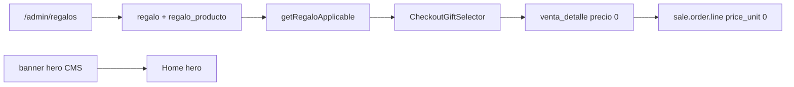

# Regalos por monto mínimo (admin + checkout + Odoo)

Documentación de la feature de **regalos** (obsequio al superar un umbral de compra) para futuros cambios.

**Referencia live:** [oneclickstore.com](https://www.oneclickstore.com/) — hero “COMPRANDO DESDE $750.000…” + plugin Woo *Free Gifts* (reemplazado aquí por lógica nativa).  
**Última actualización:** 2026-07-28  
**Admin:** `/admin/regalos`

---

## 1. Qué hace

1. En admin se define una **regla de regalo**: nombre, monto mínimo de compra, vigencia, lista de SKUs elegibles.
2. En el **checkout**, si el subtotal del carrito ≥ `monto_minimo` de un regalo activo y vigente, el cliente **debe elegir** uno de los SKUs.
3. Al crear la venta se agrega un `venta_detalle` extra a **precio 0** (no suma a subtotal/total ni a ítems de Mercado Pago).
4. Al sincronizar con Odoo, la `sale.order` incluye una **línea de producto real** (`product_id` = `odoo_id` del SKU) con `price_unit = 0` y nombre con sufijo `(Regalo)`.
5. El **banner hero** de marketing ($750.000 / Ditoys) es CMS independiente (`/admin/banners`, `ubicacion=hero`); no está acoplado al monto de la regla.

**Única condición de negocio:** subtotal carrito/orden ≥ `monto_minimo`. No hay gatillo por categoría ni por producto comprado.

---

## 2. Modelo de datos

Definido en [`prisma/schema.prisma`](../prisma/schema.prisma).

### `regalo`

| Campo | Tipo | Uso |
|-------|------|-----|
| `id_regalo` | PK | |
| `nombre` | string | Label admin / copy checkout |
| `monto_minimo` | Decimal(12,2) | Umbral sobre **subtotal** del carrito |
| `vigencia_desde` / `vigencia_hasta` | DateTime | `hasta` null = sin fin |
| `activo` | bool | |
| `fecha_creacion` | DateTime | Auditoría |
| `id_usuario_creacion` | FK → `usuario` | Admin que creó la regla |
| `fecha_modif` | DateTime | `@updatedAt` |

### `regalo_producto`

M2M `(id_regalo, id_producto)`. El SKU se lee de `producto.sku`; el producto **debe** tener `odoo_id` si el sync Odoo está habilitado.

### Resolución en runtime

[`getRegaloApplicable(subtotal)`](../src/lib/regalos.ts):

1. Filtrar `activo` + vigente + `monto_minimo <= subtotal` + al menos un producto activo asociado.
2. Elegir el de **mayor `monto_minimo`**; si empatan, el más reciente (`fecha_creacion` desc).

### Migración / seed

- Schema: `npx prisma db push` (o migrate) + `npx prisma generate`.
- No hay seed de reglas de regalo: se cargan en admin.
- Hero invierno: assets en `public/oneclick/hero-invierno-*.webp` + `pill-invierno.webp`; HTML en [`prisma/seed.ts`](../prisma/seed.ts) (el hero se **reescribe** en cada seed).

---

## 3. Archivos clave

| Rol | Path |
|-----|------|
| Queries / validación selección | [`src/lib/regalos.ts`](../src/lib/regalos.ts) |
| Alta venta + línea $0 + stock | [`src/lib/checkout-venta.ts`](../src/lib/checkout-venta.ts) |
| Línea Odoo `price_unit=0` | [`src/lib/odoo-venta.ts`](../src/lib/odoo-venta.ts) (`createOdooSaleOrder`) |
| UI selector checkout | [`src/components/checkout-gift-selector.tsx`](../src/components/checkout-gift-selector.tsx) |
| Página checkout | [`src/app/(shop)/checkout/page.tsx`](../src/app/(shop)/checkout/page.tsx) |
| Estilos selector | `globals.css` (`.oc-checkout-gift*`) |
| Admin listado / nuevo / detalle | [`src/app/admin/regalos/`](../src/app/admin/regalos/) |
| Server Actions | [`src/app/admin/regalos/actions.ts`](../src/app/admin/regalos/actions.ts) |
| Nav admin | [`src/app/admin/layout.tsx`](../src/app/admin/layout.tsx) |
| Prueba E2E Odoo | [`scripts/test-checkout-odoo.ts`](../scripts/test-checkout-odoo.ts) `--regalo` |
| Checkout → Odoo (general) | [`docs/ODOO-CHECKOUT.md`](./ODOO-CHECKOUT.md) |

---

## 4. Flujo



### Checkout

1. `getRegaloApplicable(cart.subtotal)` → si hay regla, render `CheckoutGiftSelector`.
2. Radios `name="id_producto_regalo"` (HTML `required` + `form.reportValidity` en pago tarjeta).
3. Server: `resolveSelectedRegaloProducto(subtotal, id)` — exige selección válida si aplica.
4. `venta_detalle`: `precio_unitario = 0`, `precio_cobrado = 0`, `nombre_producto` con `(Regalo)`.
5. Stock local + Odoo del SKU regalo (mismo almacén que el pedido).
6. `itemsCobro` / preferencia MP **excluyen** líneas a $0.

### Odoo

En el loop de `venta.detalles`:

- Si `precio_cobrado ≈ 0` → `price_unit = 0`, nombre con `(Regalo)`.
- Impuestos: se usa `pickSaleTaxes` igual que en líneas pagas (si `tax_id` queda en `false`, Odoo aplica los taxes del producto y puede fallar por IVA duplicado). Con precio 0 el importe de impuesto es 0.
- El force post-create de pricelist **preserva** `price_unit = 0`.
- El ajuste fino de totales **omite** líneas con `price_unit ≈ 0` (no absorben redondeo).
- Es producto real → entra al picking/stock como el resto.

**Prueba verificada (training, 2026-07-28):** venta `#12` → orden `OCWN-12` con línea regalo SKU `409912186` a `price_unit=0`.

---

## 5. Admin

| Acción | Ruta |
|--------|------|
| Listado | `/admin/regalos` |
| Alta | `/admin/regalos/nuevo` |
| Edición + SKUs | `/admin/regalos/[id]` |

Campos editables: nombre, monto mínimo, vigencia desde/hasta, activo.  
Usuario y fecha de creación: solo lectura (sesión al crear).

Asociación de productos: buscar por **título o SKU** → Agregar / Quitar (mismo patrón que promociones).

---

## 6. Pruebas

```bash
# Venta retiro con línea de regalo a $0 en Odoo
npm run test:checkout-odoo -- --regalo

# Envío + regalo
npm run test:checkout-odoo -- --envio --regalo
```

El flag `--regalo`:

1. Elige un producto de venta con stock/`odoo_id`.
2. Elige (o reutiliza) un segundo producto distinto como obsequio (stock en el mismo almacén).
3. Asegura una regla `regalo` activa con `monto_minimo` ≤ subtotal y el SKU asociado.
4. Crea `venta_detalle` de pago + línea regalo a $0.
5. Simula pago MP y ejecuta `syncVentaToOdoo`.
6. Imprime las líneas Odoo; la del regalo debe tener `price_unit: 0`.

Requisitos: `.env` con Odoo training/prod, parámetros grupo `odoo`, productos con `odoo_id` y stock.

---

## 7. Checklist al modificar

1. ¿Nuevo umbral / campaña? → Admin Regalos (no hardcode); actualizar copy del hero en Banners si hace falta.
2. ¿SKU nuevo de obsequio? → Debe existir en catálogo con `sku` + `odoo_id` + stock; asociarlo a la regla.
3. ¿Cambio en totales Odoo? → Verificar que líneas `price_unit=0` no se filtren ni se usen en el ajuste de redondeo (`odoo-venta.ts`).
4. ¿Selector checkout? → Mantener `required` + validación server en `resolveSelectedRegaloProducto`.
5. Probar: `npm run test:checkout-odoo -- --regalo` y revisar `OCWN-<id>` en Odoo.
6. Documentar aquí y en [ODOO-CHECKOUT.md](./ODOO-CHECKOUT.md) si cambia el contrato de la línea regalo.

---

## 8. Fuera de alcance (esta entrega)

- Barra de progreso de regalo en el drawer del carrito.
- Acoplar el monto del banner hero al `monto_minimo` de la regla.
- Migración del plugin Woo Free Gifts / Force Sells.
